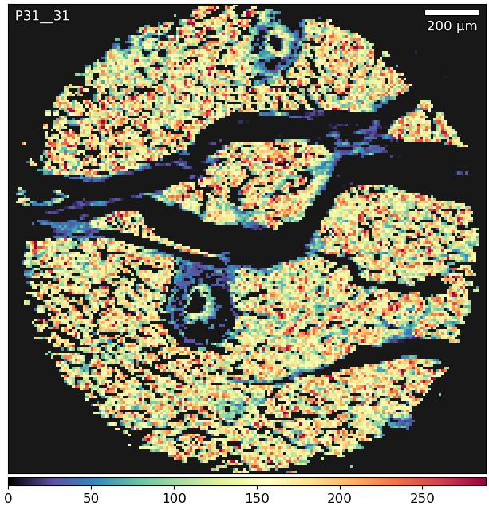

Selection Dialog
================

.. meta::
   :keywords: select, selection. threshold

The `Selection Dialog` selects a region based on a given threshold value or method.
The `Method` and `Comparison` combo-boxes selects the method for creating the thresholding value and
to compare the data to it.
As an example, if the `Method` produces a value of 1 and the `Comparison` is '>' then all values greater
than 1 will be selected.

Checking `Limit selection to current selection` will select the intersection (:math:`A \cap B`)
with the previously selected area.

Checking `Limit thresholding to selected value` will pass only currently selected values
to the thresholding method.

    Extraction of tissue from background using the `Selection Dialog` and Otsu's method.

See also :ref:`Example: Mean of a region`.
