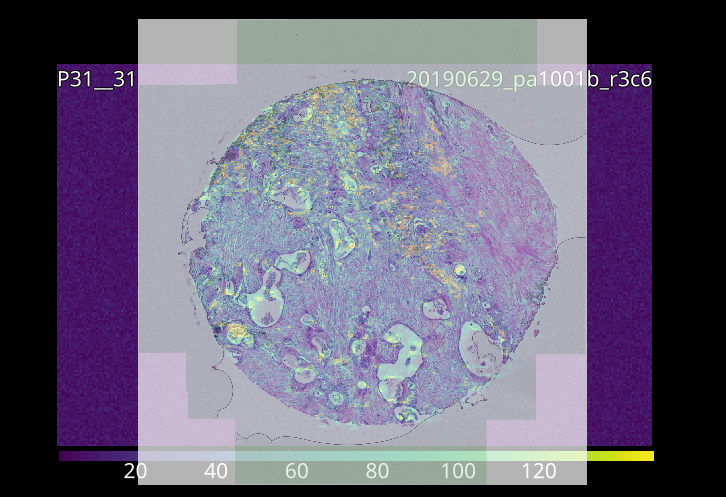

Example: Selecting ROIs from an Image
=====================================

Data selection can be guided by loading an image into |pewpew|, most image formats are supported.

|pewpew| implements two different tools for manual region selection,
the `Rectangle Selector` and `Lasso Selector`.
These tools function similarly to selection tools in other programs,
with regions selected by clicking and dragging on the image.

Holding **Shift** will **add** to the currently selected region while holding **Ctrl** will **subtract** from it.

.. figure:: ../images/tutorial_overlay_images.png
    :width: 400px
    :align: center

    A loaded laser and overlay image.

1. Load a laser and image file.
    Both type sof image can be loaded using drag-and-drop or the :ref:`Import Wizard`.

    Aligned images.

2. Align the images manually.
    Overlay image scale can be set via the `Pixel Size` in the image context menu,
    or by using the affine or scale-rotate controls.

.. figure:: ../images/tutorial_overlay_images_selection.png
    :width: 400px
    :align: center
    
    Locking images allows selection through them.

3. Select region using the selection tools.
    Lock the overlay image to prevent interaction. See :ref:`Basic Usage` for details on selection tools.
