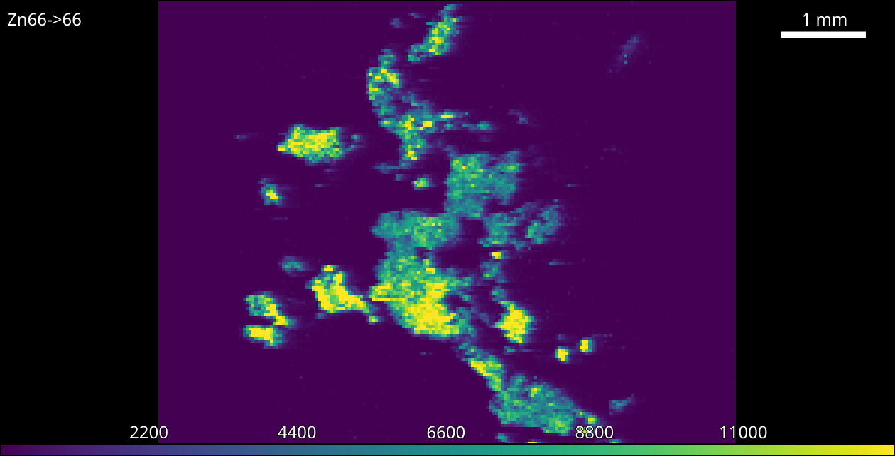

Example: Quantifying A Sample
=============================

One of the most common uses of |pewpew| is quantifying collected data.
In this example we will quantify a sample using standards measured just before its ablation.

    
    Sample before calibration.

1. Import the sample and standard images.
    |
    
2. Open the `Standards Tool` and select isotope and number of calibration levels.
    |
    
3. Isolate calibration area using guides.
    The white guides define the area for each calibration level and can be moved or resized using the mouse.
    Multiple levels can be moved at once be first selecting using **Shift** or **Ctrl** and dragging or clicking levels.

4. Fill in concentrations.
    The concentration table supports copy and paste of data from spreadsheet programs but may also be filled in manually.
    If you wish to exclude a level from the calibration *leave its concentration blank*.

5. Optionally add a unit and weighting.
    Selection of the correct weighting is the users responsibility [1]_ .

6. Click the `Apply All` button.
    This will apply the calibration to both the standard and sample.

7. Repeat for other isotopes.
    |

    
    The newly calibrated colorbar.

    
.. rubric:: Footnotes

.. [1] See https://pubs.acs.org/doi/pdf/10.1021/ac5018265.
