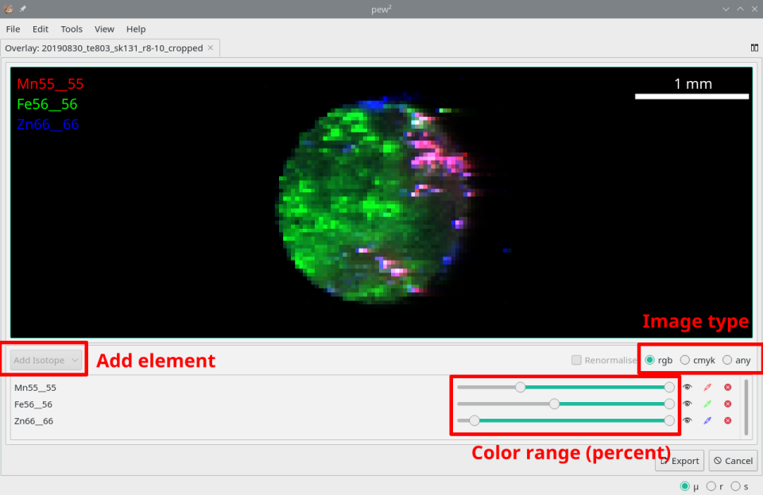
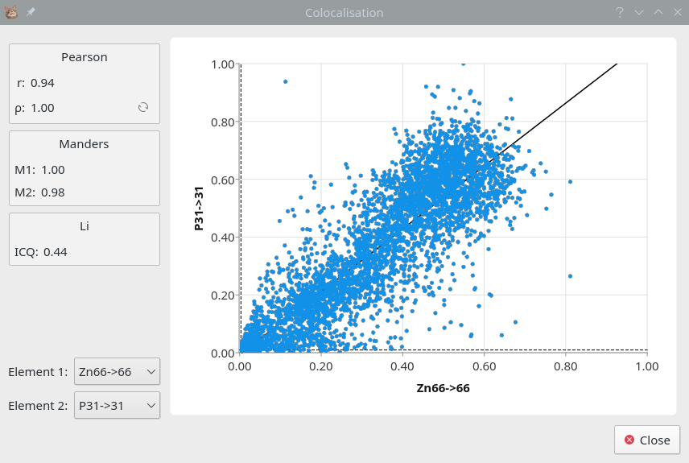

Colocalisation Dialog
=====================

It is often desired to analyse the spatial relationship of two or more elemental images.
The `Overlay Tool` can do this visually while the `Colocalisation Dialog` provides a numerical representation.

Overlays
--------

* **Tools -> Overlay Tool**

The `Overlay Tool` allows overlaying of up to three elements using the RGB or CMYK modes,
or any number using the 'any' mode.
If using the any mode take care to to over-saturate the image.

    The Overlay Tool with three elements in RGB mode.

Colocalisation
--------------

* **Image Context Menu -> Colocalisation**
* **Selection Context Menu -> Statistics**

Colcalisation can be used to quantify the spatial relationship between two elements.
The `Colocalisation` dialog provides numerical and graphical representations of colocalisation using the Costes_ method.
This method automatically eliminates background values before performing colocalisation,
however the image must have a large enough dynamic range.

    The Colocalisation dialog.

.. _Costes: https://doi.org/10.1529/biophysj.103.038422
