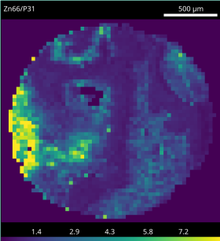

Calculator: Thresholded division of elements
============================================

See also :ref:`Calculator`.

Division of two elements is commonly used to normalise one element to another.
Without thresholding of low background values this can produce a rather unattractive image.

.. centered::
    |calc_img_bad| = |calc_img_z66| / |calc_img_p31|

In this example we use the calculator tool to simultaneously threshold and divide two elements.

.. centered::
    |calc_img_div| = |calc_img_z66| / |calc_img_p31|

.. |calc_img_p31| image:: ../images/tutorial_calc_p31.png
    :width: 200px

.. |calc_img_bad| image:: ../images/tutorial_calc_baddiv.png
    :width: 200px

1. Determine the background value of the divisor image.
    In this example a value of 100 sufficed.

2. Using the calculator tool perform the operation.
    Enter ``if P31 > 100 then Zn66 / P31 else 0`` into the `Formula` box.

    The first part of the if/then/else masks the data so only values above the threshold are
    operated on. The second part performs the division while the last part sets unmasked data to 0.

3. Enter the new name, and click `Apply`.
    Choose a unique name to prevent overwriting data.
