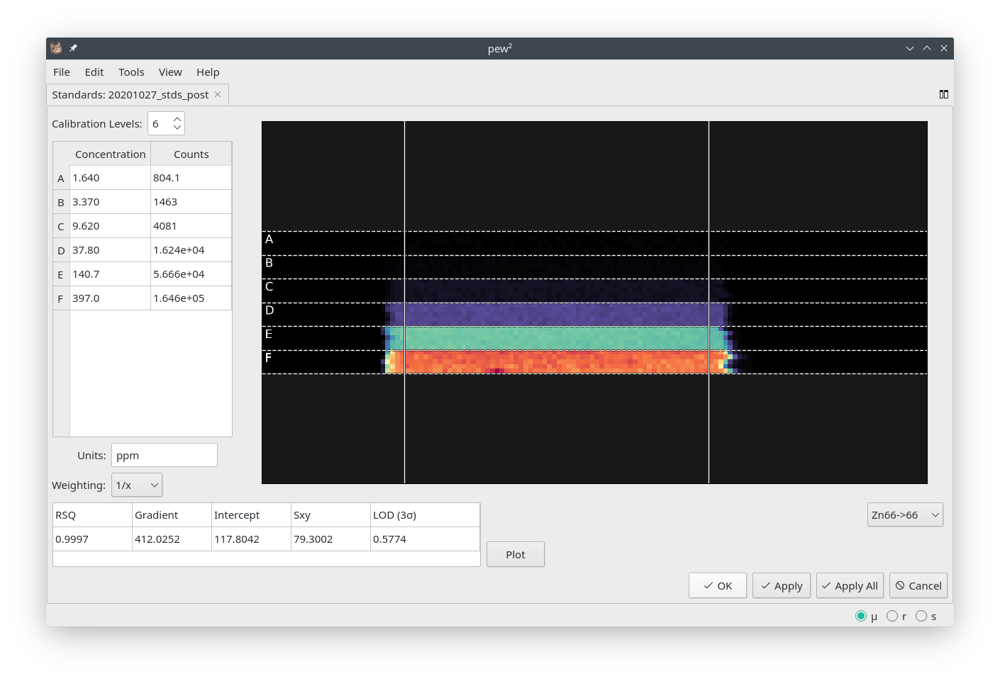

Calibration
===========

There are two ways of calibrating data in |pewpew|.

    Calibration standards loaded into the `Standards Tool`.

Standards Tool
--------------

* **Tools -> Standards Tool**

Opening the `Standards Tool` will load the active laser image,
allowing the generation of a calibration curve from external standards.
Data should be collected line-by-line with all similar calibration levels in adjacent lines.

1. Select isotope and number of calibration levels.
    If your data has a gap (i.e. missing line) add a calibration level and leave it blank in step 3.

2. Isolate calibration area using guides.
    The white guides over the image can be moved by dragging with the mouse.
    The two vertical guides indicate the start and end of the calibration area while the horizontal guides
    separate the individual levels.

3. Fill in concentrations.
    The concentration table supports copy and paste of data from spreadsheet programs but may also be filled in manually.
    If you wish to exclude a level from the calibration *leave its concentration blank*.

4. Optionally add a unit and weighting.
    Selection of the correct weighting is the users responsibility [1]_ .

5. Click the `Apply` button.
    If you wish to also apply the calibration to other loaded images click the `Apply All` button.

6. Repeat for other isotopes.
    |

.. figure:: ../images/tutorial_calibration_plot.png
    :width: 240px
    :align: center

    Clicking the `Plot` button will show the calibration curve.
    Right clicking the plot allows copying the image to the clipboard.

.. rubric:: Footnotes

.. [1] See https://pubs.acs.org/doi/pdf/10.1021/ac5018265.
