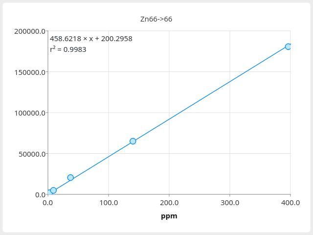

Calibration
===========

.. figure:: ../images/tutorial_calibration_tool.png
    :align: center

    Calibration standards loaded into the `Standards Tool`_.
    Red highlights indicate important controls.

Calibration Dialog
------------------

* **Right Click -> Calibration**

The calibration dialog allows manual entry of the gradient, intercept and unit for each isotope.
Entry of specific concentrations and responses is possible using the points table and will automatically update the gradient, intercept and unit.
To apply the current calibration to all other open images check the `Apply calibration to all images.` box and then click `Apply`.
The current (or all) calibrations can be copied to the clipboard and pasted in open images using **Ctrl+V**.

Standards Tool
--------------

* **Tools -> Standards Tool**

Opening the `Standards Tool` will load the active laser image,
allowing the generation of a calibration curve from external standards.
Data should be collected line-by-line with all similar calibration levels in adjacent lines.

1. Select isotope and number of calibration levels.
    |

2. Isolate calibration area using guides.
    The white guides define the area for each calibration level and can be moved or resized using the mouse.
    Multiple levels can be moved at once be first selecting using **Shift** or **Ctrl** and dragging or clicking levels.

3. Fill in concentrations.
    The concentration table supports copy and paste of data from spreadsheet programs but may also be filled in manually.
    If you wish to exclude a level from the calibration *leave its concentration blank*.

4. Optionally add a unit and weighting.
    Selection of the correct weighting is the users responsibility [1]_ .

5. Click the `Apply` button.
    If you wish to also apply the calibration to other loaded images click the `Apply All` button.

6. Repeat for other isotopes.
    |

Calibration Curve
-----------------

Both the `Calibration Dialog`_ and `Standards Tool`_ have a button `Button Plot` that will open
a window with the current calibration plotted.

    Calibration curve, right clicking the plot allows copying the image to the clipboard.

.. rubric:: Footnotes

.. [1] See https://pubs.acs.org/doi/pdf/10.1021/ac5018265.
