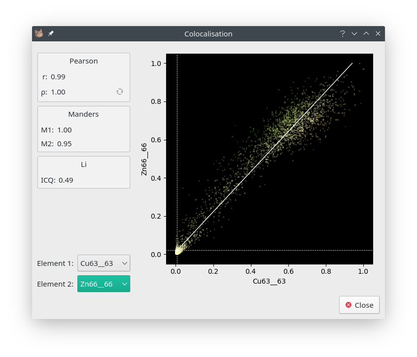

Colocalisation
==============

* ** Image Context Menu -> Colocalisation **

Colcalisation can be used to quantify the spatial relationship between two elements.
The `Colocalisation` dialog provides numerical and graphical representations of colocalisation using the Costes_ method.
This method automatically eliminates background values before performing colocalisation,
however the image must have a large enough dynamic range.

    The Colocalisation dialog.

.. _Costes: https://doi.org/10.1529/biophysj.103.038422
