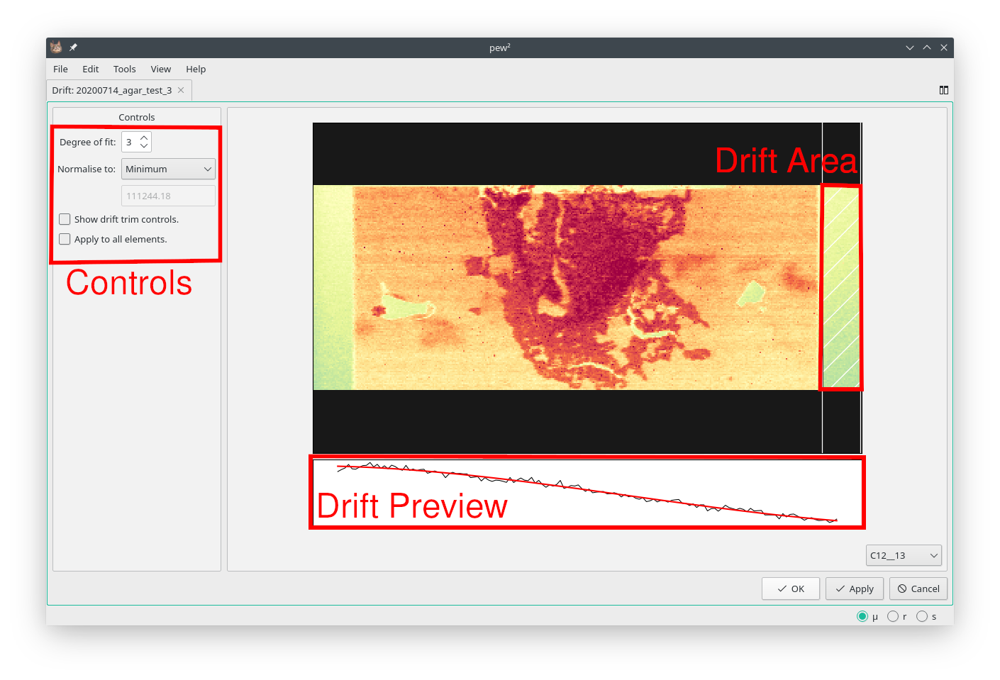
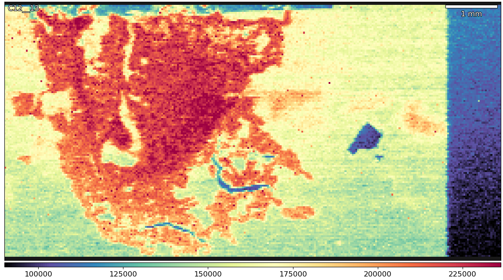
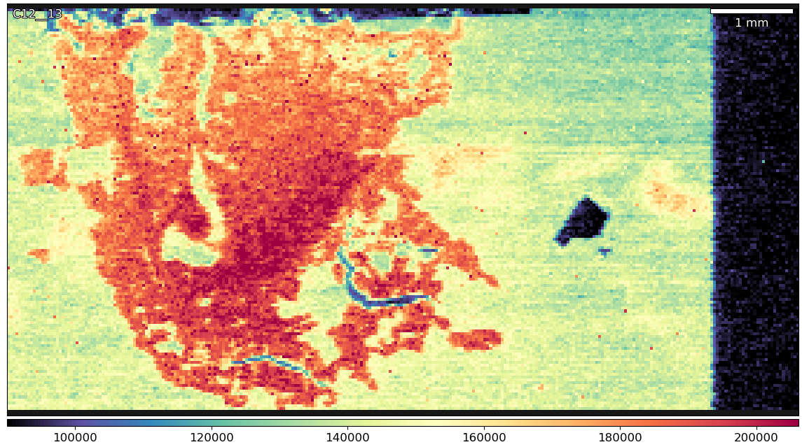

Drift Compensation
==================

    Important controls of the `Drift Compensation` tool.

* **Tools -> Drift Compensation**

Changes in laser, plasma or mass-spec conditions cause signal drift and
should be minimised by using short runs and correctly 'warming up' the ICP-MS.
In cases where quantification is not required then drift can be compensated using the
`Drift Compensation` tool.
This tool fits a polynomial to a section of the image and then normalises with
respect to the fit.

Example: Compensating Laser Drift
~~~~~~~~~~~~~~~~~~~~~~~~~~~~~~~~~

    An image with signal drift.

1. Select drift area.
    Drag the white guides to cover an area where no sample is present,
    such as the start or end of an image.
    If there sample is present throughout an image then use the trim controls
    (`Show drift trim controls.`) to remove the sample area.

2. Select the degree of fit.
    The second line in the drift preview shows the fitted polynomial.
    A degree of 0 will use the raw data.

3. Select normalisation method.
    The available options allow normalisation to wither the minimum or maximum
    signal in the drift area.

    The same image after drift compensation.
