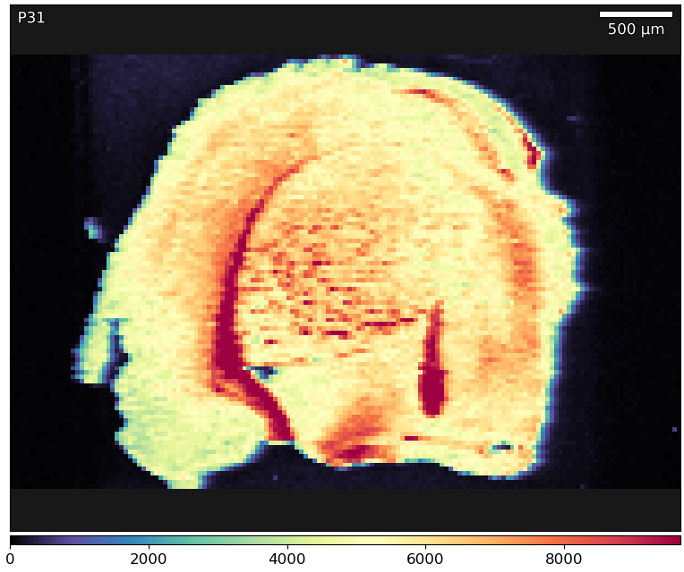
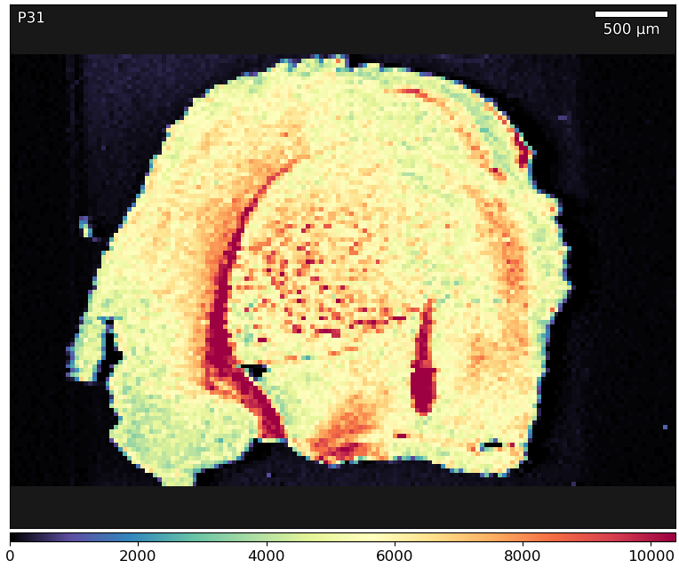
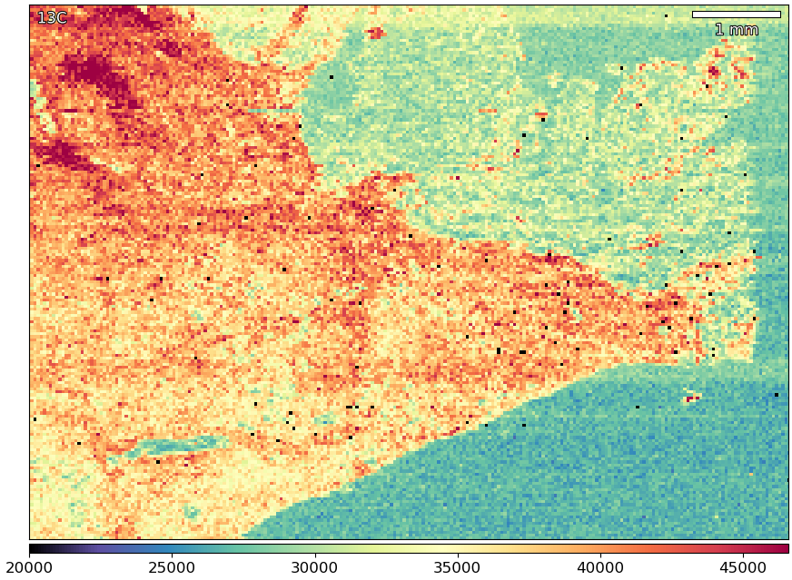
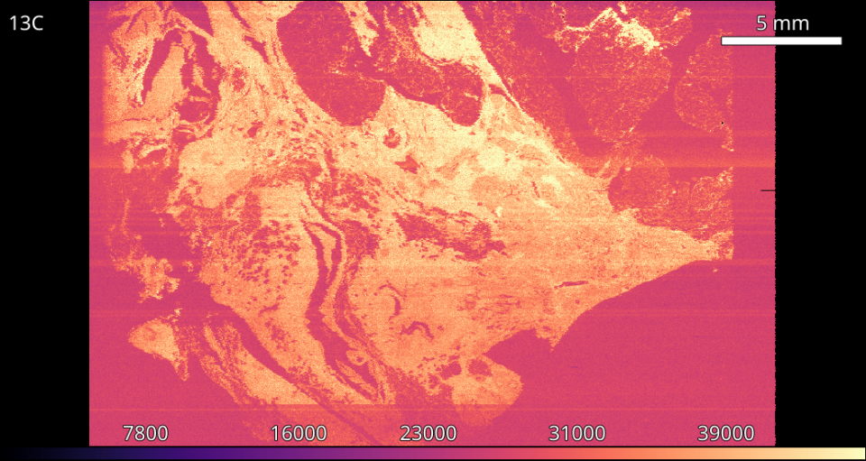

Image Processing
================

Calculator
----------

* **Tools -> Edit Tool -> Calculator**

The built in `Calculator` can perform simple calculations on image data by
entering the desired formula into the `Formula` text box.
The formula box will turn red if the input is invalid.
For types of supported input and examples see :ref:`calc_input` and for
supported functions see :ref:`calc_functions`.
The `Results` text box will show numerical results.

Supported Input
~~~~~~~~~~~~~~~

.. table:: Supported `Formula` inputs with examples.
    :name: calc_input
    :align: center

    +--------------------+------------------------------------------------+
    |Type                |Example                                         |
    +====================+================================================+
    |Image names         |``P31``                                         |
    |                    |                                                |
    |                    |``153Eu/31P``                                   |
    +--------------------+------------------------------------------------+
    |Mathematical Symbols|``+  -  *  /  ^  (  )``                         |
    |                    |                                                |
    |                    |``a / (b + 1)``                                 |
    |                    |                                                |
    |                    |``1e3 + P31``                                   |
    +--------------------+------------------------------------------------+
    |If / then / else    |``if P31 > 1e3 then P31 else 0``                |
    |                    |                                                |
    |                    |``Eu153 > P31 ? Eu153 : P31``                   |
    +--------------------+------------------------------------------------+
    |Functions           |``threshold(P31, median(P31))``                 |
    |                    |                                                |
    |                    |``if P31 > kmeans(P31, 3)[2] then P31 else nan``|
    +--------------------+------------------------------------------------+

Supported Formulas
~~~~~~~~~~~~~~~~~~

.. table:: Calculator functions.
    :name: calc_functions
    :align: center

    +----------+-----------------+------------------------------------+
    |Function  |Arguments        |Result                              |
    +==========+=================+====================================+
    |abs       |image            |absolute values of image            |
    +----------+-----------------+------------------------------------+
    |kmeans    |image, k         |array of lower k-means bounds       |
    +----------+-----------------+------------------------------------+
    |mean      |image            |mean value of the image             |
    +----------+-----------------+------------------------------------+
    |median    |image            |median value of the image           |
    +----------+-----------------+------------------------------------+
    |nantonum  |image            |sets image NaN values to zero       |
    +----------+-----------------+------------------------------------+
    |normalise |image, min, max  |image normalised to `min`, `max`    |
    +----------+-----------------+------------------------------------+
    |otsu      |image            |Otsu's method of image              |
    +----------+-----------------+------------------------------------+
    |percentile|image, percentile|the `percentile`'th value of image  |
    +----------+-----------------+------------------------------------+
    |threshold |image, value     |sets all pxiels below `value` to nan|
    +----------+-----------------+------------------------------------+

Example: Thresholded division of elements
~~~~~~~~~~~~~~~~~~~~~~~~~~~~~~~~~~~~~~~~~

Division of two elements is commonly used to normalise one element to another.
Without thresholding of low background values this can produce a rather unattractive image.

.. centered::
    |calc_img_bad| = |calc_img_z66| / |calc_img_p31|

In this example we use the calculator tool to simultaneously threshold and divide two elements.

.. centered::
    |calc_img_div| = |calc_img_z66| / |calc_img_p31|

.. |calc_img_z66| image:: ../images/tutorial_calc_Zn66.png
    :width: 150px
.. |calc_img_p31| image:: ../images/tutorial_calc_p31.png
    :width: 150px
.. |calc_img_div| image:: ../images/tutorial_calc_ZndivP.png
    :width: 150px
.. |calc_img_bad| image:: ../images/tutorial_calc_baddiv.png
    :width: 150px

1. Determine the background value of the divisor image.
    In this example a value of 100 sufficed.

2. Using the calculator tool perform the operation.
    Enter ``if P31 > 100 then Zn66 / P31 else 0`` into the `Formula` box.

    The first part of the if/then/else masks the data so only values above the threshold are
    operated on. The second part performs the division while the last part sets unmasked data to 0.

3. Enter the new name, and click `Apply`.
    Choose a unique name to prevent overwriting data.

Convolution
-----------

* **Tools -> Edit Tool -> Convolve / Deconvolve**

The `Convolve` and `Deconvolve` tools enable the creation of a kernel that can be
convolved with image data in one or two dimensions. For a full list of kernels see
:ref:`convolve_kernels`. The `Size` (in pixels) and `Scale` of each kernel is also
alterable.

Available Kernels
~~~~~~~~~~~~~~~~~

.. table:: Convolution kernels and parameters.
    :name: convolve_kernels
    :align: center

    +-------------------+-----------+-----------+-----------+
    | Kernel            | Parameters                        |
    +===================+===========+===========+===========+
    | Beta              | α [0, ∞)  | β [0, ∞)  |           |
    +-------------------+-----------+-----------+-----------+
    | Exponential       | λ [0, ∞)  |           |           |
    +-------------------+-----------+-----------+-----------+
    | Inverse-gamma     | α [0, ∞)  | β [0, ∞)  |           |
    +-------------------+-----------+-----------+-----------+
    | Laplace           | b [0, ∞)  | μ (-∞, ∞) |           |
    +-------------------+-----------+-----------+-----------+
    | Log-Laplace       | b [0, ∞)  | μ (-∞, ∞) |           |
    +-------------------+-----------+-----------+-----------+
    | Log-normal        | σ [0, ∞)  | μ (-∞, ∞) |           |
    +-------------------+-----------+-----------+-----------+
    | Gaussian (normal) | σ [0, ∞)  | μ (-∞, ∞) |           |
    +-------------------+-----------+-----------+-----------+
    | Super-Gaussian    | σ [0, ∞)  | μ (-∞, ∞) | P (-∞, ∞) |
    +-------------------+-----------+-----------+-----------+
    | Triangular        | a (-∞, 0] | b [0, ∞)  |           |
    +-------------------+-----------+-----------+-----------+

Example: Removing wash-out blur
~~~~~~~~~~~~~~~~~~~~~~~~~~~~~~~

    An image with wash-out blur, seen on the right hand side of the tissue.

1. Calculate the wash-out time in pixels.
    If the wash-out time is known then use wash-out (s) / acquisition time (s).

2. `Deconvolve` in one-dimension with a non-symmetrical point-spread-function.
    In this example `Log-Normal` (size=12; σ=1.50, μ=0.0) worked well.

3. Optional, to remove deconvolution artefacts take the absolute value of the image.
    Use the abs() function in the `Calculator`.

    The same image post-deconvolution. Notice the lessen blur on the right hand side.

Filtering
---------

* **Tools -> Edit Tool -> Filter**

Instrument noise often causes unwanted spikes in data.
The `Filter` tool removes spikes by applying a rolling filter across an image.

Filters
~~~~~~~

.. table:: Implemented filters.
    :name: filter_methods
    :align: center

    +----------------+---+--------------------------------------------+
    | Type           | Threshold                                      |
    +================+===+============================================+
    | Rolling Mean   | σ | Distance in stddevs from the local mean.   |
    |                |   | Stddev excludes the tested value.          |
    +----------------+---+--------------------------------------------+
    | Rolling Median | M | Distance in medians from the local median. |
    +----------------+---+--------------------------------------------+

Example: De-noising an image
~~~~~~~~~~~~~~~~~~~~~~~~~~~~

    Negative spikes (-33) are visible due the to instrument missing an acquisition
    cycle.

1. Using the `Filter` tool select the appropriate filter.
    Available filters are `Mean` and `Median`.

2. Select appropriate filter size.
    Typical window sizes are 3, 5 or 7. A larger window size will be more
    sensitive in detecting outlying data but is more likely to introduce artifacts.

3. Select the appropriate filter threshold.
    An outlyling data (those above the the thresholds in :ref:`filter_methods`)
    are set to the relevant local value.
    An ideal threshold will change invalid data while leaving valid data untouched.

    A rolling mean filter replaces the invalid values with the local mean.
