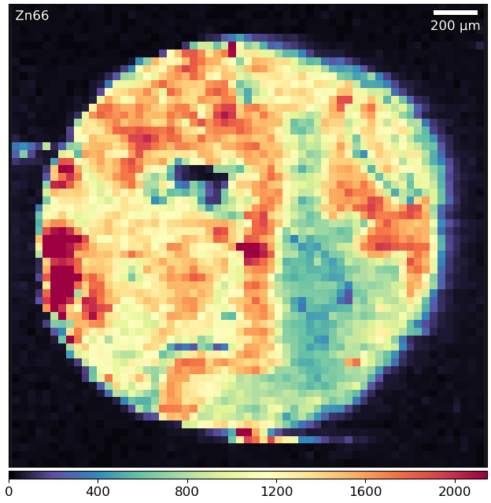
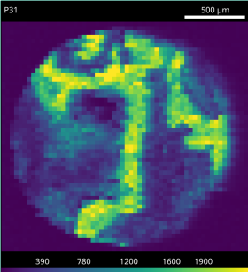
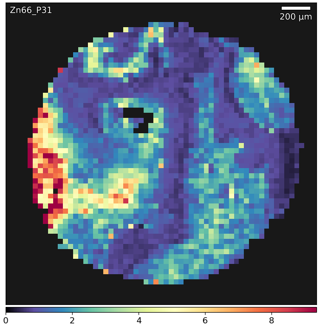
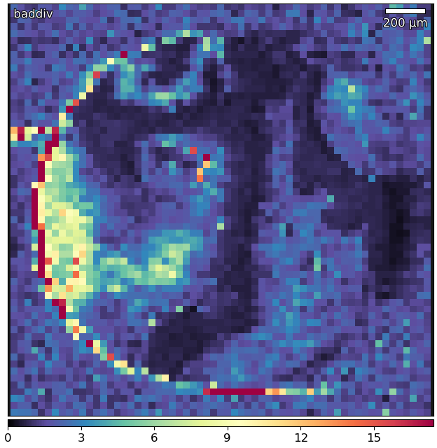

Image Processing
================

Calculator
----------

* **Tools -> Edit Tool -> Calculator**

The built in `Calculator` can perform simple calculations on image data by
entering the desired formula into the `Formula` text box.
The formula box will turn red if the input is invalid.
For types of supported input and examples see :ref:`calc_input` and for
supported functions see :ref:`calc_functions`.
The `Results` text box will show numerical results.

Supported Input
~~~~~~~~~~~~~~~

.. table:: Supported `Formula` inputs with examples.
    :name: calc_input

    +--------------------+------------------------------------------------+
    |Type                |Example                                         |
    +====================+================================================+
    |Image names         |``P31``                                         |
    |                    |                                                |
    |                    |``Eu153``                                       |
    +--------------------+------------------------------------------------+
    |Mathematical Symbols|``+  -  \*  /  ^  (  )``                        |
    |                    |                                                |
    |                    |``a / (b + 1)``                                 |
    |                    |                                                |
    |                    |``1e3 + P31``                                   |
    +--------------------+------------------------------------------------+
    |If / then / else    |``if P31 > 1e3 then P31 else 0``                |
    |                    |                                                |
    |                    |``Eu153 > P31 ? Eu153 : P31``                   |
    +--------------------+------------------------------------------------+
    |Functions           |``threshold(P31, median(P31))``                 |
    |                    |                                                |
    |                    |``if P31 > kmeans(P31, 3)[2] then P31 else nan``|
    +--------------------+------------------------------------------------+

Supported Formulas
~~~~~~~~~~~~~~~~~~

.. table:: Calculator functions.
    :name: calc_functions

    +----------+-----------------+------------------------------------+
    |Function  |Arguments        |Result                              |
    +==========+=================+====================================+
    |abs       |image            |absolute values of image            |
    +----------+-----------------+------------------------------------+
    |kmeans    |image, k         |array of lower k-means bounds       |
    +----------+-----------------+------------------------------------+
    |mean      |image            |mean value of the image             |
    +----------+-----------------+------------------------------------+
    |median    |image            |median value of the image           |
    +----------+-----------------+------------------------------------+
    |normalise |image, min, max  |image normalised to `min`, `max`    |
    +----------+-----------------+------------------------------------+
    |otsu      |image            |Otsu's method of image              |
    +----------+-----------------+------------------------------------+
    |percentile|image, percentile|the `percentile`'th value of image  |
    +----------+-----------------+------------------------------------+
    |threshold |image, value     |sets all pxiels below `value` to nan|
    +----------+-----------------+------------------------------------+

Example: Thresholded division of elements
~~~~~~~~~~~~~~~~~~~~~~~~~~~~~~~~~~~~~~~~~

Division of two elements is commonly used to normalise one element to another.
Without thresholding of low background values this can produce a rather unattractive image.

.. centered::
    |calc_img_bad| = |calc_img_z66| / |calc_img_p31|

In this example we use the calculator tool to simultaneously threshold and divide two elements.

.. centered::
    |calc_img_div| = |calc_img_z66| / |calc_img_p31|

1. Determine the background value of the divisor image.
    In this example a value of 100 sufficed.

2. Using the calculator tool perform the operation.
    Enter ``if P31 > 100 then Zn66 / P31 else 0`` into the `Formula` box.

    The first part of the if/then/else masks the data so only values above the threshold are
    operated on. The second part performs the division while the last part sets unmasked data to 0.

3. Enter the new name, and click `Apply`.
    Choose a unique name to prevent overwriting data.
