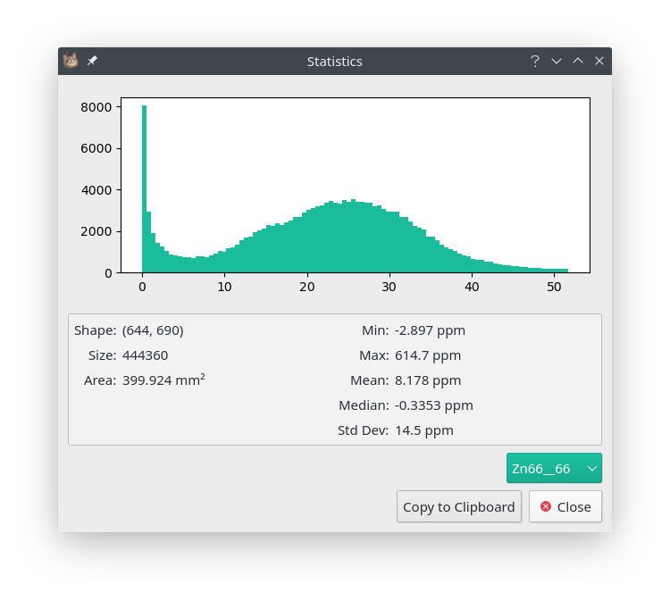

Statistics
==========

* ** Image Context Menu -> Statistics **

Basic statistical data is available in the `Statistics` dialog, accessible by right clicking an image.
If a region is selected (see :ref:`Region Selection`) then the dialog will only process
that region, otherwise the entire image is processed.
To copy the statistics for all available elements click the `Copy to Clipboard` button.

    The Statistics dialog. A histogram of the data is shown in the top part of the
    dialog and a few basic statistics in the bottom.

Example: Means in a region
~~~~~~~~~~~~~~~~~~~~~~~~~~

1. Using the selection tools, select the desired region.
    See :ref:`Region Selection` for a details on the selection tools.

2. Open the `Statistics Dialog` in selection.
    Right clicking the selection will open its context menu.

3. Export the statistics using `Copy to Clipboard`.
    Statistics can now be pasted into a spreadsheet program.
