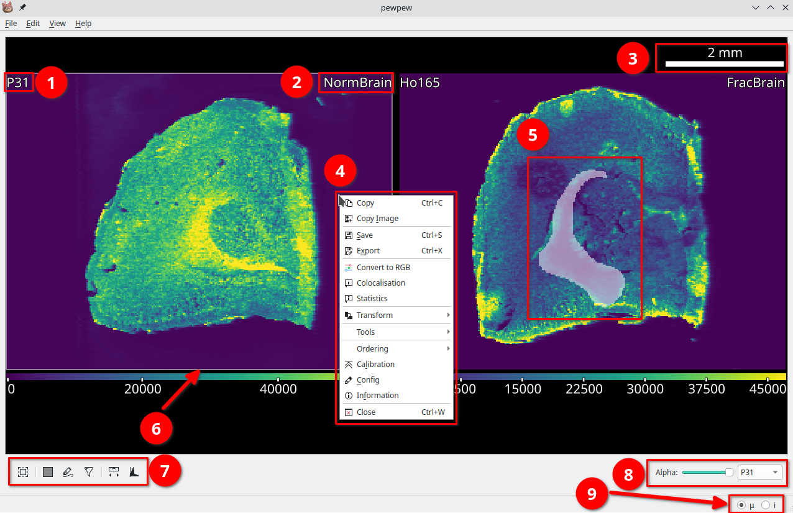

Basic Usage
===========
.. index:: Basic Usage

   An open image in |pewpew|. (1) Selected element. (2) Image name, right click to rename. (3) Scalebar. (4) Right click context menu. (5) A selected region. (6) Active image is highlighted. (7) Tools for the active image. (8) Options for selected image. (9) Cursor unit, (μ = μm, i = pixel).

The first step in using |pewpew| is to load or import data.
For an example of using the import wizard see :ref:`Example: Importing file-per-line data` or read :ref:`Import Wizard`.
Images can be moved by click and dragging with either the left mouse button and the scene navigated using the middle mouse and scroll wheel.
New scenes can be added using **Edit -> New Tab**.

Import and export controls are located in the **File** menu,
parameters in the **Edit** menu and tools for calibration, processing and visualisation of data under **Right Click -> Tools**.

The **View** menu contains options for customising the visual style of images.
Here you will find controls for the size and visibility of text, the color table and image smoothing.
Color table ranges are individually editable for each open element via **View -> Colortable -> Set Range** or **Ctrl+R**.
A range of perceptually uniform (or near) color tables are available.

Selections
~~~~~~~~~~

|pewpew| implements two different tools for manual region selection,
the `Rectangle Selector` and `Lasso Selector`.
These tools function similarly to selection tools in other programs,
with regions selected by clicking and dragging on the image.

Holding **Shift** will **add** to the currently selected region while holding **Ctrl** will **subtract** from it.

Saving and Exporting
~~~~~~~~~~~~~~~~~~~~

Files can be saved as a Numpy archive via the right click context menu **Right Click -> Save**.
This archive will also include any calibration and configurations applied to the image.
To export use either the `Export Dialog` **Right Click -> Export** or the batch `Export All Dialog` **File -> Export All**.
These dialogs export the current or all images in a range of formats.
